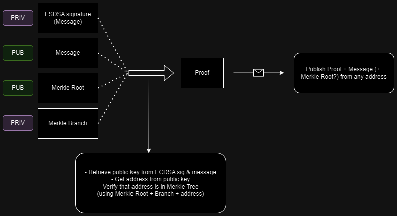

# 🔗 Circuits

Circuits source code: https://gitlab.com/distributed_lab/ethereum-experiments/zk-prover/

*zk-SNARKs* were chosen for zero knowledge proofs generation due to their low proof size, as proofs are published to the blockchain where storage can be quite expensive.
**DAVID** supports *Groth16* and *PLONK* schemes. Both those schemes requires trusted setup (pre-circuit in *Groth16* and universal in *PLONK*). 

Currently we are using computer randomness for this setup. As long as malicious adversary cannot obtain access to secret parameters used in setup, the system is considered secure. For production MPC (multiparty computation computation) is recommended for the security purposes (*Powers of Tau* ceremony). 

For *zk-SNARK* circuits engineering Go library **gnark** is used.

Problem definition for **ZKP**: given a *message* and a *Merkle root hash* (aggregation of the *whitelisted* users, the root hash is computed and published by the oracle) as ***public*** inputs; *message signature* (by the *whitelisted* user) and *Merkle branch* (can be obtained from the oracle) as private inputs. Generate proof that the message is signed by the *whitelisted* user.

**ZKP** Modules required:
- *ECDSA* signature verification over ***secp256k1***: used to verify that user indeed has access to *whitelisted* account without using private key directly;
- *Keccak256* hash function: used to obtain address from public key (public key itself is recovered from *message* and *signature*);
- *Poseidon* hash function: used to verify that the address is agregated in the Merkle Tree (which is build on Poseidon hash function);

Why *Poseidon* hash function was chosen for Merkle Tree?
- The *Poseidon* is a hash function designed for zero-knowledge proof systems like *zk-SNARKs*. The main advantage of the Poseidon hash is simplification in circuits building. By using this hash function (instead of something more popular like Keccak of SHA-256) we significantly reduce amount of constraints, proving key size and proof generation time.

Circuits are compiled into *WASM*, which then can be executed in browser to generate proof.

Circuit inputs:

- *(priv)* ***Sig***: ESDSA signature of the message hash emulated on *Secp256k1* curve; We need to emulate *Secp256k1* curve as this curve is native for EVM-compatible blockchains, and currently user in EVM-compatible wallet (like MetaMask) can sign message only by using this curve;

- **(pub)** ***Msg***: hash of the message that was signed;

- *(priv)* ***Pub***: public key of the user that is signing the message; This field is not required as we can obtain public key of the signer by using `EcRecover(Sig, Msg)`, but using it simplifies proof logic. *May be removed in future releases;*

- **(pub)** ***TreeLevel***: parameter that indicates what is the current depth of a *Merkle Tree*;

- *(priv)* ***Path***: array of Merkle Branches, length **20**; Length is predefined in circuit and indicates maximal depth of a *Merkle Tree*;

- **(pub)** ***RootHash***: Merkle Tree Root.

If depth of a Merkle Tree is static, why do we need to specify *TreeLevel*?

- This is done to optimize *Merkle Tree* operations. When the number of participants is low, the oracle builds a *Merkle Tree* with a lower depth. When verifying, the user retrieves only the needed amount of *Merkle Branches* to get to *Merkle Root* and submits an array of those branches (*Path*) and their size (*TreeLevel*). All other items in *Path* are left empty (***0***). Circuit for verification will ignore them.

***Circuits key serialization:***

Considering peculiarities of the ethereum precompiled contracts, and mainly how input is brought in the function, it is needed to have efficient serialization mechanism to pass several arguments in one input. That is why here is used the following schema in big-endian format:

- **UINT16** - *elliptic curve ID*
- **UINT32** - length of public witness
- *Public witness*
- **UINT32** - length of the proof
- *Proof*
- *Verifier key*

***Amount of resouces taken by the functions:***

