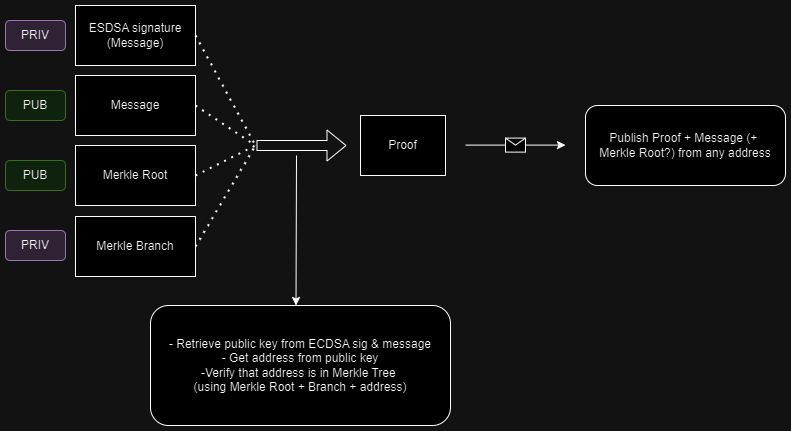

# 🤖DOVID

***DOVID*** enables users to establish their affiliation with a particular group or community while safeguarding their identity and personal details. More precisely, it facilitates the submission of anonymous feedback regarding purchased items. The verification of item ownership is facilitated through a unique Non-Fungible Token (NFT) issued to users upon item acquisition. Other participants have the ability to confirm that the feedback contributor is indeed the owner of the item, all the while preserving the author's anonymity.

## Technologies overview

### 🧙 Oracle 

***DOVID*** uses a trusted oracle for gathering and aggregating information about *NFTs* owners. The cryptographic accumulator (in the form of a *Merkle Tree*) is then published to the blockchain. Moreover, the oracle provides access to the data that is necessary for a user to generate a membership proof.

### 🔗 Circuits

Go library **gnark** is used for circuits that are used to prove that the user obtains an account from a given set.

### 💻Frontend

Frontend modules provides an ability for user to create a feedback message, sign it with wallet (like Metamask), create a proof that the message is indeed written by the authorized user (by generating zero knowledge proofs *gnark circuits* compiled to *wasm*) and publish *message & proof* from any other account.

## 🏢 System Design

<!--  -->

## Zero Knowledge Proofs Design

